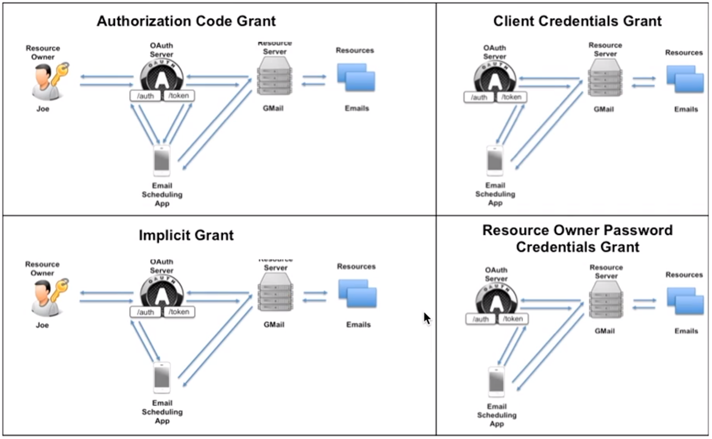

### OAuth2 Project with examples

### Code Flow Grant

Description of all steps: 

* Steps:

* Get "code" from /auth endpoint scheme:

"state" - part of application where we would like to move on.

* Get Token from /token endpoint scheme:

Explanation of "Authorization Basic" here: 
"czZCaGRSa3F0MzpnWDFm" is a string consists from "clientID" + ":" + "clientSecret" and base64 encoded.
This is the CLIENT(3rd party app) credentials. They could be validated by Oauth server.
To get clientID and Secret you need to register device first.

* Interactions with Resource Server:

* Get a new Access token:

We need to send refresh token and get a new access token.
Pay attention on refresh token in response - refresh token is also changed as well as access token.
Next time we should send a new refresh token.

* Get a new Refresh token:

