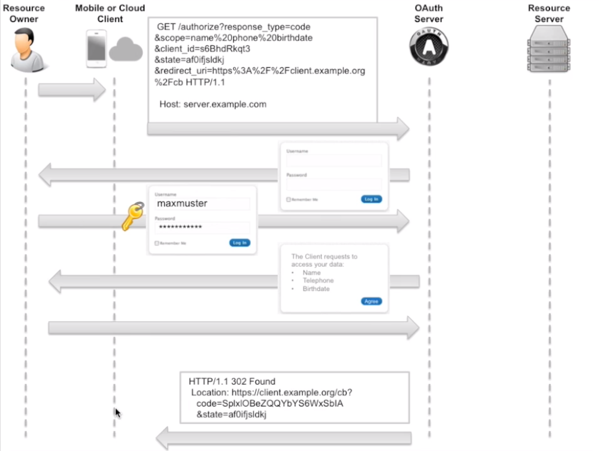
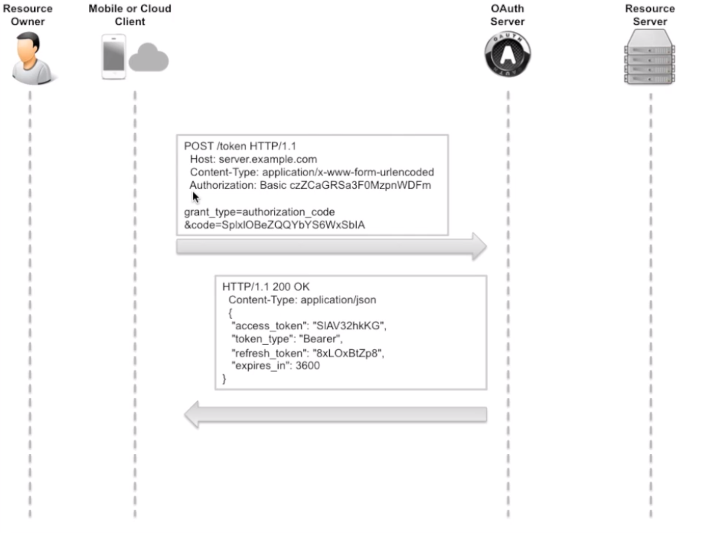
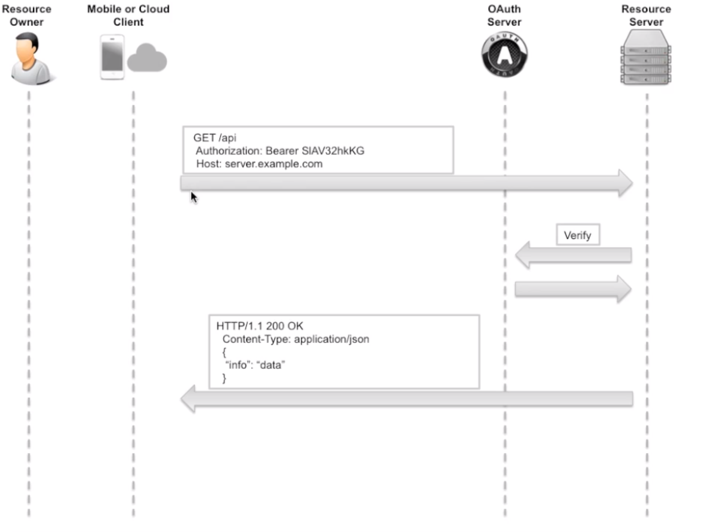
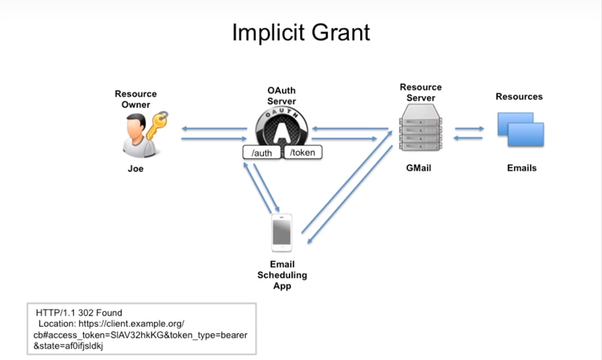

### OAuth2 Project with examples


### Code Flow Grant
<details>
<summary>Description of all steps: </summary>

Steps:


1: Get "code" from /auth endpoint scheme:

* "state" - part of application where we would like to move on.
* "scope" - part of information which we would like to take from resource server.
* "redirect_url" - http address where we will be redirected after the very last oauth response step by using HTTP 304 Redirect.

2: Get Token from /token endpoint scheme:

* "czZCaGRSa3F0MzpnWDFm" is a string consists from "clientID" + ":" + "clientSecret" and base64 encoded.
* This is the CLIENT(3rd party app) credentials. They could be validated by Oauth server.
To get clientID and Secret you need to register device first.

2: Interactions with the Resource Server:


3: Get a new Access token:

* We need to send a refresh token and get a new access token.
Pay attention on refresh token in response - refresh token was also changed as well as access token.
Next time we should send a new refresh token to get a new access token. Old refresh token - will be invalid.
* grant_type should be "refresh_token"

4: Get a new Refresh token:

* To get a new refresh token (after unauthorized response trying to take a new access token) we need to send
grant_type "refresh_token" and old token in "refresh_token" field. 

</details>

### Implicit Grant Flow

<details>
<summary>Description of all steps: </summary>
Scheme:


* Implicit flow doesn't require to use /token endpoint.
* It returns access token directly.

</details>

### Client Credentials Grant Flow (for machine-to-machine (M2M) applications, such as CLIs, daemons, or services)

<details>
<summary>Description of all steps: </summary>
Scheme:


* Credentials Grant flow doesn't require to use /auth endpoint
* Client and Owner is the same in this flow. Uses CliendID and ClientSecret to get access token
* Doesn't require a refresh token.
* Ease explanation could be found here
https://auth0.com/docs/flows/concepts/client-credentials
or here https://docs.microsoft.com/en-us/azure/active-directory/develop/v2-oauth2-client-creds-grant-flow.

</details>

### Resource Owner Password Credentials Grant
* Password anti-pattern
* FOR Trust relationship client or device / operating system / highly privileged app only
* Could be used in situations when Resource server and Official Client was produced by one organization: 
dropbox official mobile app and dropbox resource server.
* It obtains and uses username and password directly, but DOESN'T STORE IT (delete credentials immediately after getting token)

Pros and Cons: Client doesn't guarantee that it will delete username and password after obtaining tokens (access and refresh)

<details>
<summary>Description of all steps: </summary>

* The authorization server should take special care when enabling this grant type and only allow it when other flows are not viable.
* This grant type is suitable for clients capable of obtaining the resource owner’s credentials (username and password,
typically using an interactive form). 
* It is also used to migrate existing clients using direct authentication schemes
such as HTTP Basic or Digest authentication to OAuth by converting the stored credentials to an access token.

Scheme:

* Credentials Grant flow doesn't require to use /auth endpoint as same as Credentials Grant Flow.

</details>

### Facebook Code Grant Information
<details>
<summary>OAuth Worksheet for Facebook:</summary>

Documentation:

https://developers.facebook.com/docs/facebook-login/manually-build-a-login-flow/#login

Prerequisites:

Facebook Account
curl
---


Client Registration:
https://developers.facebook.com/

What you need:

appId = clientId =
appSecret = clientSecret =
redirectURI =
URLENCODE(redirectURI) =


your redirect URI needs to have a slash in the end!

---


Authorization Endpoint (Browser):

https://www.facebook.com/dialog/oauth?client_id=clientId&redirect_uri=URLENCODE(redirectURI)

What you need:

code =

---

Token Endpoint:

non-standard: it is a GET instead of a POST
curl -ik "https://graph.facebook.com/v2.4/oauth/access_token....URLENCODE(redirectURI)&client_id=clientId&client_secret=clientSecret&code=code"

What you need:

access_token =

---
Resource Access:

curl -H "Accept: application/json" -H "Authorization: Bearer access_token" "https://graph.facebook.com/me"

</details>

### LinkedIn Code Grant Information

<details>


<summary>OAuth Worksheet for LinkedIn: </summary>

Documentation

https://developer.linkedin.com/docs/oauth2
---
Prerequisites:

LinkedIn Account
curl

Client Registration

https://www.linkedin.com/developer/apps
---
What you need:

redirectURI =
URLENCODE(redirectURI) =
clientId =
clientSecret =

---


Authorization Endpoint (Browser)

https://www.linkedin.com/uas/oauth2/authorization?...clientId&redirect_uri=URLENCODE(redirectURI)

What you need:

code =
---


Token Endpoint:

curl -ik -X POST https://www.linkedin.com/uas/oauth2/accessToken -d grant_type=authorization_code -d code=code -d redirect_uri=URLENCODE(redirectURI) -d client_id=clientId -d client_secret=clientSecret

What you need:

access_token =
---


Resource Access:

curl https://api.linkedin.com/v1/people/~ -H "Authorization: Bearer access_token"

</details>

### OAuth for Android and Ios

<details>
<summary> Q: What is the use of the redirect uri for a mobile application needing a token? The mobile is not reachable by URL? </summary>


A: The redirect URI for mobile apps typically has a custom protocol.

An example of a redirect URI for mobile apps: myapp:///events/3/

This URL is sent back in the location header to the web browser on the mobile including the HTTP status code 301 for redirect. The browser on the mobile now interprets the location header and resolves the address. MyApp needs to have a custom protocol handler installed on the device, so the browser redirects the request directly to the App on the same mobile device.

If you want to get into detail on how to install custom protocol handlers on iOS or Android, read the following:

---
Android
---

For Android, refer to Intent Filter to Launch My Activity when custom URI is clicked.

You use an intent-filter:
```
<intent-filter>

  <action android:name="android.intent.action.VIEW" /> 

  <category android:name="android.intent.category.DEFAULT" /> 

  <category android:name="android.intent.category.BROWSABLE" /> 

  <data android:scheme="myapp" /> 

</intent-filter>
```


* This is attached to the Activity that you want launched. For example:
```
<activity android:name="com.MyCompany.MyApp.MainActivity" android:label="@string/app_name">

  <intent-filter>

      <action android:name="android.intent.action.MAIN" />

      <category android:name="android.intent.category.LAUNCHER" />

  </intent-filter>
  <intent-filter>
  
      <action android:name="android.intent.action.VIEW" />

      <category android:name="android.intent.category.DEFAULT" />

      <category android:name="android.intent.category.BROWSABLE" /> 
      
      <data android:scheme="myapp" android:host="com.MyCompany.MyApp" />

  </intent-filter>
</activity>
```

* Then, in your activity, if not running, the activity will be launched with the URI passed in the Intent.

Intent intent = getIntent();

Uri openUri = intent.getData();

If already running, onNewIntent() will be called in your activity, again with the URI in the intent.

* Lastly, if you instead want to handle the custom protocol in UIWebView's hosted within your native app, you can use:

myWebView.setWebViewClient(new WebViewClient()

```
{
 public Boolean shouldOverrideUrlLoading(WebView view, String url)
 {
  // inspect the url for your protocol
 }
});
```

---

iOS

---

* For iOS, define your URL scheme via Info.plist keys similar to:
```

<key>CFBundleURLTypes</key>
    <array>
        <dict>
            <key>CFBundleURLName</key>
            <string>com.yourcompany.myapp</string>
        </dict>

        <dict>
            <key>CFBundleURLSchemes</key>
            <array>
                <string>myapp</string>
            </array>
        </dict>
    </array>
```

* Then define a handler function to get called in your app delegate:

- (BOOL)application:(UIApplication *)application openURL:(NSURL *)url sourceApplication:(NSString *)sourceApplication annotation:(id)annotation

```{
 // parse and validate the URL
}
```

* If you want to handle the custom protocol in UIWebViews hosted within your native app, you can use the UIWebViewDelegate method:

- (BOOL)webView:(UIWebView *)webView shouldStartLoadWithRequest:(NSURLRequest *)request navigationType:(UIWebViewNavigationType)navigationType

```
{
 NSURL *urlPath = [request URL];
 if (navigationType == UIWebViewNavigationTypeLinkClicked)
 {
    // inspect the [URL scheme], validate
    if ([[urlPath scheme] hasPrefix:@"myapp"]) 
    {
      ...
    }
  }
}
}
```

* For WKWebView (iOS8+), you can instead use a WKNavigationDelegate and this method:

- (void)webView:(WKWebView *)webView decidePolicyForNavigationAction:(WKNavigationAction *)navigationAction decisionHandler:(void (^)(WKNavigationActionPolicy))decisionHandler
```
{
 NSURL *urlPath = navigationAction.request.URL;  
 if (navigationAction.navigationType == WKNavigationTypeLinkActivated)
 {
   // inspect the [URL scheme], validate
   if ([[urlPath scheme] hasPrefix:@"myapp"])
   {
    // ... handle the request
    decisionHandler(WKNavigationActionPolicyCancel);
    return;
   }
 }

 //Pass back to the decision handler
 decisionHandler(WKNavigationActionPolicyAllow);
}
```

</details>

